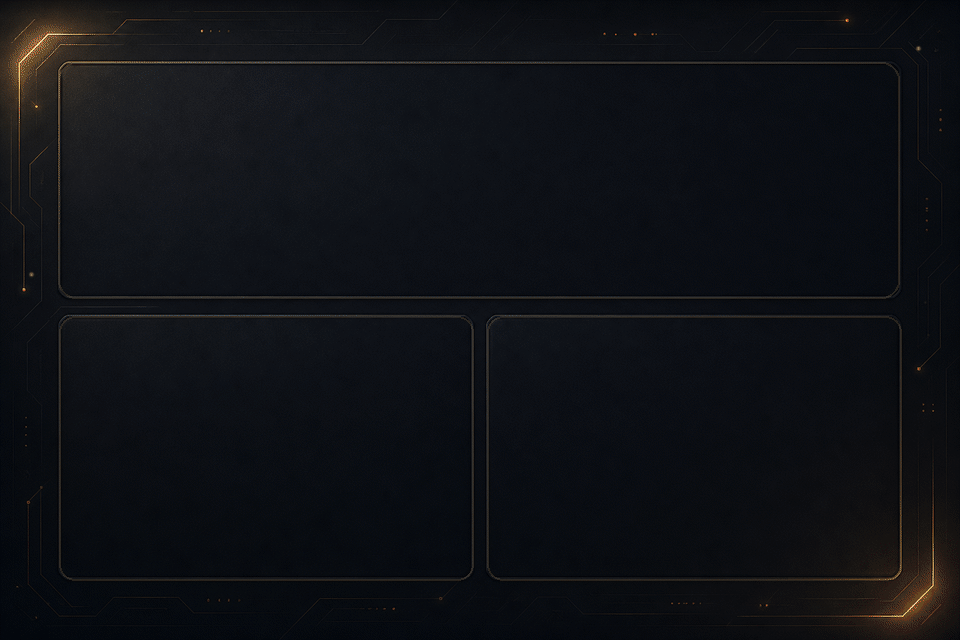

<p align="center">
  
</p>

<p align="center">
  
  <br><br>
  <a href="https://www.codewars.com/users/RickyAudreyValencia">
    
  </a>
</p>

---

<h2 align="center">Developer Dashboard</h2>

<p align="center">
  <sub>Live GitHub metrics • coding activity • contribution streak</sub>
</p>

<p align="center">
  
</p>

<p align="center">
  
</p>

<details>
<summary><strong>Live Coding Activity</strong></summary>
<br>

<!--START_SECTION:waka-->

```txt
From: 26 August 2026 - To: 26 August 2026

Total Time: 0 secs

No activity tracked
```

<!--END_SECTION:waka-->

</details>

### Contribution Snake

<p align="center">
  
</p>

### Badge Collection

<p align="center">
  <a href="https://holopin.io/@rickyaudrey">
    
  </a>
</p>

---

## Listening & Reading

<table>
  <tr>
    <td width="62%" align="center" valign="middle">
      <h3>Recently Played on Spotify</h3>
      
    </td>
    <td width="38%" align="center" valign="middle">
      <h3>My daily.dev</h3>
      <a href="https://daily.dev/rickyaudreyvalencia">
        
      </a>
    </td>
  </tr>
</table>
